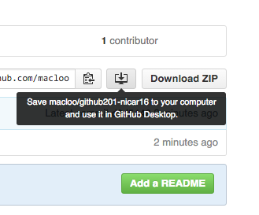
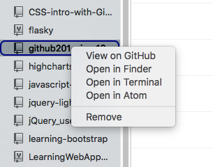
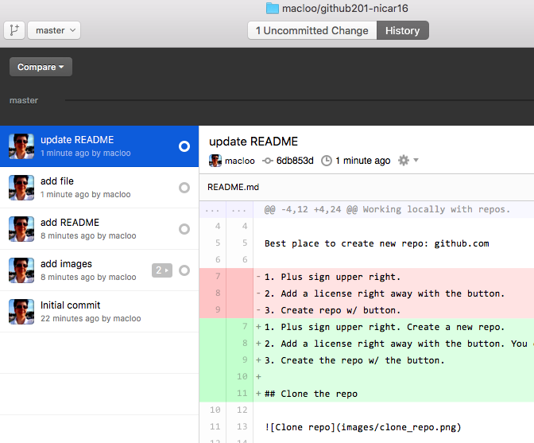
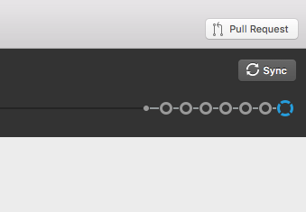

# Stuff from a workshop

Working locally with repos.

Best place to create new repo: github.com

1. Plus sign upper right. Create a new repo.
2. Add a license right away with the button. You can also add an empty README.
3. Create the repo w/ the button.

## Clone the repo

**Note:** Have the GitHub app open.

In the GitHub app: Navigate to folder where you want repo to be. Then clone (there's a button). This will create a new folder with the same name as your repo.

## Edit a file or files

Above: In the GitHub app, you can open the whole repo in the Atom text editor.

## Commit messages

Write commit message(s) in the GitHub app. "Think about telling a story." Your commits should be logical messages for you and for others to describe the changes you have made.

To make "rewinding" the repo easy and logical, commit separate files separately.

## The 'History' tab

Above: Switch to "History" view with the button, top center.

## Sync with GitHub.com

With Sync, you will upload all your committed changes to github.com, making your repo up-to-date with your local repo.
